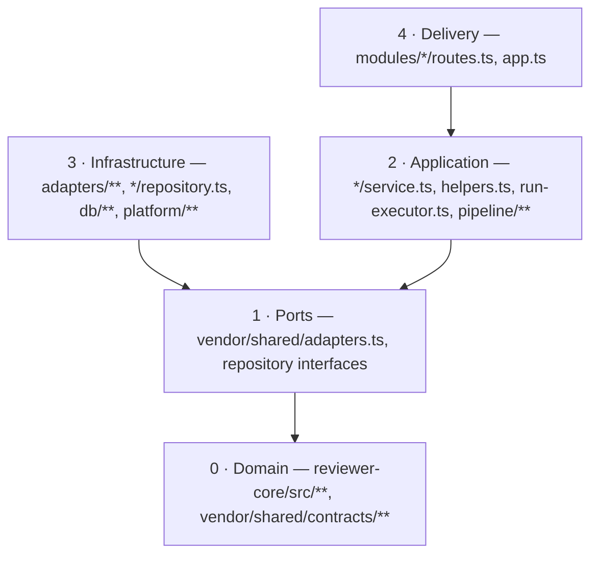

# Onion architecture — DevDigest backend

Scope: `server/**` and `reviewer-core/**`. For the client use `frontend-architecture`.

## The rule

**Imports point inward.** Delivery may know the application layer, the application layer may
know ports, ports know only the domain. Nothing inward may know Fastify, Drizzle, Octokit, or
a concrete adapter class. The database is not the centre — it is external.

Enforced, not merely documented: `cd server && pnpm arch:check` (~1 s).



## Ring map — real paths, not abstractions

| Ring | Lives in | May import | Never imports |
|---|---|---|---|
| 0 Domain | `reviewer-core/src/**`, `server/src/vendor/shared/contracts/**` | zod, itself | anything under `server/src` |
| 1 Ports | `vendor/shared/adapters.ts`, repository interfaces | ring 0 | any implementation |
| 2 Application | `modules/*/service.ts`, `helpers.ts`, `run-executor.ts`, `repo-intel/pipeline/**` | rings 0–1, `platform/errors` | `drizzle-orm`, `src/db/**`, `fastify`, `src/adapters/**` |
| 3 Infrastructure | `src/adapters/**`, `modules/*/repository*.ts`, `src/db/**`, `src/platform/**` | rings 0–1 | any `routes.ts` |
| 4 Delivery | `modules/*/routes.ts`, `src/app.ts` | rings 0–2, `platform/{errors,container}` | `drizzle-orm`, `src/db/schema`, `src/adapters/**` |

`platform/container.ts` + `modules/index.ts` are the **composition root**. They are allowed to
see every ring at once — that is their job, not a violation. Everything else takes its
dependencies from `container`, never by constructing a concrete class.

## Where does this code go?

| The code… | goes to |
|---|---|
| speaks HTTP (status, headers, `req`, `reply`, SSE wiring) | `routes.ts` |
| writes SQL / touches Drizzle | `repository.ts` (or `queries.ts` in a thin module) |
| shells out, calls a network API, reads the filesystem | `src/adapters/<domain>/` behind a port in `vendor/shared/adapters.ts` |
| is a pure transform over domain types (row → DTO, parse, format, rank) | `helpers.ts`, or `reviewer-core` if the CI runner needs it too |
| orchestrates several ports / decides *what happens* | `service.ts` (long-running work → its own executor) |

Still unsure? Ask which ring would have to change if we swapped Postgres for something else.
Whatever must not change belongs further in.

## Two legal module shapes

```
modules/<name>/                    modules/<name>/          ← thin module: no orchestration
  routes.ts    HTTP + Zod           routes.ts    HTTP + Zod
  service.ts   orchestration        queries.ts   the SQL
  repository.ts  SQL
  helpers.ts   pure transforms
  constants.ts literals
```

A module without a service is fine when there is nothing to orchestrate (`workspace`,
`polling`). A module with SQL **inside the route handler** is not. The missing service is a
judgement call; the inline query is the violation.

## Forbidden imports (each one is a check in `.dependency-cruiser-onion.cjs`)

1. `drizzle-orm` / `postgres` outside a repository, `src/db/`, `platform/jobs.ts`, `app.ts`.
2. `src/db/**` from a non-repository module file — except `src/db/rows.ts` (see exceptions).
3. `src/adapters/**` from a `service.ts` / `helpers.ts` — take the port off `container`.
4. `fastify` from a service, helper, or repository. HTTP stops at `routes.ts`; pass primitives
   and DTOs inward, never `req`/`reply`.
5. Any inward import of a `routes.ts` (only `modules/index.ts`, `app.ts`, the module barrel).
6. Node built-ins or infrastructure packages inside `reviewer-core/src` — the core is pure.
7. (warn) A module importing a sibling module. Cross-module reuse is brokered by `Container`.

## Sanctioned exceptions — do not "fix" these

- **`src/db/rows.ts`** — shared `$inferSelect` row types, deliberately outside any module so
  cross-cutting consumers do not import another module's data layer. Row types may circulate
  inside the server; they must not reach the HTTP response (map via `helpers.ts` → DTO) nor
  cross into `vendor/shared` or `reviewer-core`.
- **`RunRequest.parse(req.body ?? {})`** in `reviews/routes.ts` — the one body where every
  field is optional and an empty body is legal. Anywhere else, schemas validate before the
  handler runs; never hand-roll `.parse(req.body)`.
- **`platform/{prompt,grounding,structured}.ts`** — re-export shims onto `reviewer-core`. They
  stay for compatibility; new code imports `@devdigest/reviewer-core` directly.

## Running the check

```sh
cd server
pnpm arch:check       # gate: known violations ignored, anything new fails (exit 1)
pnpm arch:check:all   # the full list, including the frozen debt
pnpm arch:baseline    # regenerate the freeze file — only after a deliberate cleanup
```

`.dependency-cruiser-known-violations.json` freezes the violations that predate this guard —
it is the backend's architecture debt list. **Never add a new entry to unblock yourself.** If
a change trips the guard, either move the code to the right ring or say out loud why the rule
is wrong. Fix frozen violations opportunistically: when a task touches one of those files,
clear it and regenerate the baseline; do not launch a standalone cleanup refactor.

## Keep it proportional

This is module-level onion, not per-entity DDD. Do not add a layer that only forwards calls,
an interface with exactly one implementation and no test seam, or a repository per table. The
classic failure of a formally layered codebase is an anemic domain — rules scattered across
services while the model is a bag of fields. Prefer putting the decision next to the data it
governs (`reviewer-core`, `helpers.ts`) over a new indirection.

## Read next

- Tool-specific rules (Fastify, Drizzle, Zod, adapters, vitest) → `tooling.md`
- Sources and rationale → `references.md`
- How to actually add a module/route/adapter/job → `server/docs/module-anatomy.md`
- Request and DI flow → `server/README.md`; conventions and gotchas → `server/CLAUDE.md`
