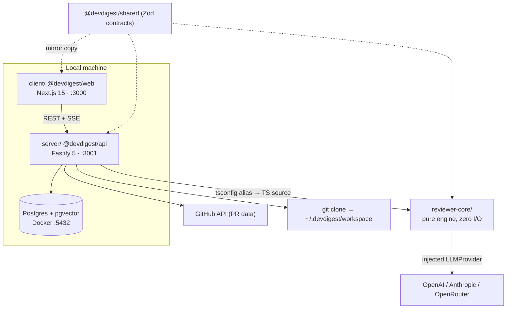
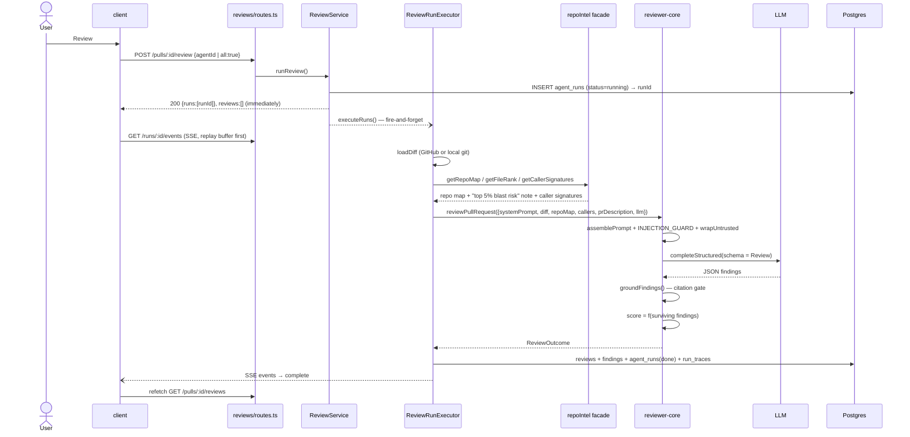

# Architecture — how a review actually runs

The end-to-end path from "user clicks Review" to "grounded findings on screen", and the
invariants that path depends on. Read this before changing anything in the review flow.

## Packages and how they reach each other

There is no build step between packages: the server imports `@devdigest/reviewer-core`
as TypeScript source (tsx in dev, vitest in tests). `reviewer-core` never emits JS — its
`build` script is a type-check.

## The review sequence

## The five invariants

**1 — Grounding is mandatory.** `reviewer-core/src/grounding.ts` drops any finding whose
`[start_line, end_line]` does not intersect a real hunk of the diff for the same file. The
score is then recomputed from the survivors; the model's self-reported score is discarded.
Findings of kind `secret_leak`, `lethal_trifecta`, `phantom`, `hook` come from full-file
scanners and only need the file to be present in the diff.

**2 — Prompt-injection defense is one trusted rule, not text scanning.** `INJECTION_GUARD`
(`reviewer-core/src/prompt.ts`) is appended to every agent's system prompt on every path.
All external content is wrapped in `<untrusted source="…">` blocks. We deliberately do not
keyword-scan untrusted text: a denylist only ever catches one phrasing in one language.

**3 — Secrets have exactly one read chokepoint.** `platform/config.ts` has no key fields by
design. `adapters/secrets/local.ts` reads `~/.devdigest/secrets.json` (mode 0600) with
`process.env` as fallback. After a key changes, call `container.invalidateSecretCaches()`.

**4 — Repo intel degrades silently.** Indexing runs as a background job after clone; a
review only *reads* the index. If the repo is unindexed, or `REPO_INTEL_ENABLED=false`, or
the agent's `repo_intel` toggle is off, the facade returns empty and the prompt sections
simply disappear. "Missing context" is not an error state.

**5 — Blockers are deterministic.** The timeline colour comes from
`countBlockers(findings, agent.ciFailOn)` — computed from finding severities, not from the
model's `verdict` field.

## Two background mechanisms, not one

- **`JobRunner`** (`server/src/platform/jobs.ts`) — clone, index, poll. A p-queue with
  concurrency 3, mirrored into the `jobs` table, with a 120s timeout and retry.
- **`RunBus`** (`server/src/platform/sse.ts`) — an **in-memory** event bus plus replay
  buffer feeding `GET /runs/:id/events`. Reviews do **not** go through JobRunner:
  `runReview` fires `void executor.executeRuns(...)` and returns the runId at once.

Because RunBus is in-memory, a server restart loses the live log — which is exactly why the
full log is persisted as one `run_traces` document, including on failure and cancellation.
On boot, `reapStaleRuns()` marks every `running` row as dead before the server accepts
requests; this assumes a **single API instance per database**.

## Tenancy

Every domain table carries `workspace_id`. Every route starts with
`getContext(container, req)` (`server/src/modules/_shared/context.ts`), which in MVP resolves
through `LocalNoAuthProvider` to the single seeded workspace and system user. Real auth is a
one-adapter swap; call sites already depend on the interface.

## Related reading

- API surface and DI flow → `server/README.md`
- UI route map → `client/README.md`
- Engine pipeline → `reviewer-core/README.md`
- Indexer internals → `server/src/modules/repo-intel/README.md`
- Prompt assembly and severity conventions → `docs/agent-prompts/README.md`
- Test strategy → `TESTING.md`
