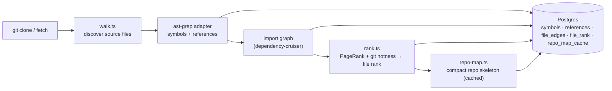

# `repo-intel` — the codebase indexer

`repo-intel` reads a cloned repository **once on clone** (and incrementally on
fetch, keyed by file content hash) and turns it into queryable facts: symbols,
the import graph, a PageRank-based file importance score, and a compact **repo
map** (the project skeleton). On a review it is only **read** — the index is
already computed, so adding context to a prompt costs no analysis at request time.

This is **starter infrastructure**: it works from day 1 (the **Indexed** badge),
but you don't write it. Course lessons build features _on top_ of its facade —
Blast Radius (L04), Conventions samples (L02), Onboarding reading-path (L05),
the Phantom-API gate (L06) — by calling `repoIntel.*`, not by re-indexing.

## Pipeline

Full vs incremental indexing lives in `pipeline/{full,incremental}.ts`; an
unindexed or partially-indexed repo degrades gracefully (the facade returns empty
results rather than throwing).

## Facade (`repoIntel.*`)

Everything downstream reads through one facade (`service.ts`) so consumers never
touch the pipeline internals:

- `getRepoMap(repoId)` → the cached repo skeleton (fed into the **review prompt**).
- `getFileRank(repoId, files)` → importance percentile per changed file.
- `getCallerSignatures(repoId, files, limit)` → callers of changed symbols.
- `getBlastRadius(repoId, files)` → impacted symbols / callers, **best effort**:
  it falls back to a ripgrep pass over the clone and re-reads clone files to
  detect endpoints when the index cannot answer.
- `getBlastRadiusFromIndex(repoId, files)` → the same map read **only** from
  Postgres, or `null` when the index cannot answer. This is what `modules/blast`
  calls (L04): a read endpoint must not parse the repository during a request,
  so `null` is rendered as a degraded state rather than paid for with a parse.
- `getDependents(repoId, files, depth)` → reverse BFS over `file_edges` keyed on
  `(repo_id, to_file)`, returning `{ file, depth, endpoints, crons }` per
  dependent. One query per level; seeds are never returned as their own
  dependents and cycles terminate.
- `getUnresolvedReferences(repoId, …)` → phantom-symbol detection (used by L06).
- `getConventionSamples(repoId)` → top-ranked files for convention extraction (L02).

`getRepoMap` / `getFileRank` / `getCallerSignatures` are wired into
`modules/reviews/run-executor.ts`, which adds the repo map and a
high-blast-radius note to the prompt; `getBlastRadiusFromIndex` and
`getDependents` are wired into `modules/blast`. Toggled by `REPO_INTEL_ENABLED`
(global) and a per-agent `repo_intel` flag.

### The constraint every blast consumer inherits

`resolveReferences` (`repository.ts`) sets `references.decl_file` only when all
three hold: there is a `file_edges` row from the referencing file to the
declaring file, the declaring file exports a symbol of exactly that name, and
there is exactly one such candidate (`HAVING count(*) = 1`). `getResolvedCallers`
then INNER JOINs `file_rank`.

Three consequences, and none of them is a bug to fix downstream: a call reached
through a barrel (`src/index.ts`) is never attributed; a symbol name two modules
both export is dropped rather than guessed; and a caller file with no rank row is
invisible, which only happens on a partial index. Precision over recall — an
ambiguous reference is not asserted as a caller.

## Routes

- `GET /repos/:id/index-state` — index status (drives the **Indexed** badge).
- `POST /repos/:id/resync` — enqueue a re-index.
